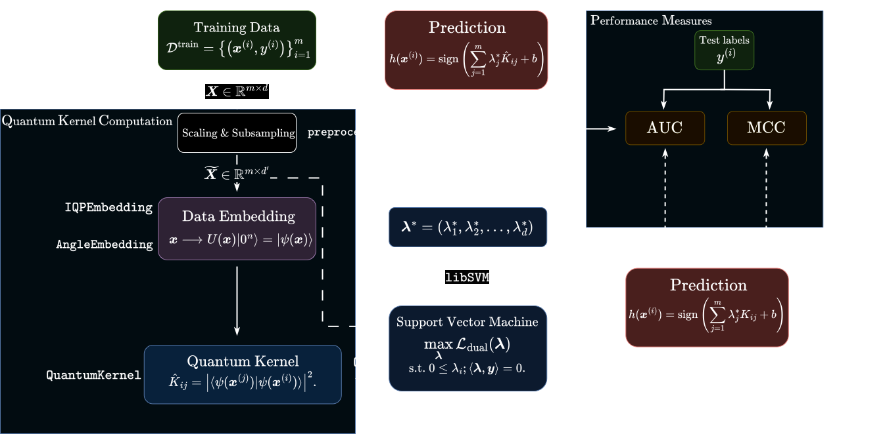

# A quantum-based approach for supervised learning (bachelor thesis) 

This is the implementation / codebase for comparing classical kernel models with their quantum-hybrid counterparts. We've trained and evaluated these models on real-world biomedical data to investigate whether the quantum-hybrid versions can achieve a better performance than their classical counterparts, potentially demonstrating a quantum advantage.

## Welcome to QMLab! 🧪

The package created is called `QMLab` - written entirely in Python, using [Pennylane](https://github.com/PennyLaneAI/pennylane) for the simulation of a quantum mechanical backend and [Sklearn](https://github.com/scikit-learn/scikit-learn) for the classical backend. The main class we use is [`QSVC`](https://github.com/Torben2907/qml-supervised/blob/master/src/qmlab/kernel/qsvm.py#L164) - short for **Q**uantum **S**upport **V**ector **C**lassifier. It inherits from the [`SVC`](https://github.com/scikit-learn/scikit-learn/blob/main/sklearn/svm/_classes.py#L604) class of Scikit-Learn and extends its functionality by allowing a quantum kernel as well as classical ones.

<!-- When render to pdf uncomment this & comment line below! -->
<!-- ⬇️ -->
<!--  -->



[Get started with the Jupyter-Tutorial-Series here!](./tutorials/01_classical_kernel_methods.ipynb)

## Information about the data 🧬

We're dealing with 9 different biomedical datasets in the thesis. The collection is coming from the study of <cite>Beinecke & Heider [[1]]</cite> that compares different augmentation methods for 
dealing with the imbalance in biomedical data.
All the datasets don't consist of many examples $m$, but have the high class imbalance and 
numerous features $d$. 

| **NAME**      | $m$  | Cases (+1)   | Controls (-1)   | $d$ |
|---------------|------|--------------|-----------------|-----|                 
| **SOBAR**     | 72   | 21           | 51              | 19  |
| **NAFLD**     | 74   | 22           | 52              | 9   |
| **Fertility** | 100  | 12           | 88              | 9   |
| **WPDC**      | 198  | 47           | 151             | 32  |
| **Haberman**  | 306  | 81           | 225             | 3   |
| **HCV**       | 546  | 20           | 526             | 12  |
| **WDBC**      | 569  | 212          | 357             | 30  |
| **CCRF**      | 761  | 17           | 744             | 7   |
| **Heroin**    | 942  | 97           | 845             | 11  |
| **CTG**       | 1831 | 176          | 1655            | 22  |

In the original paper different algorithms for data augmentation in order to deal with the imbalance 
have been compared.
We have implemented a quantum kernel classifier based on <cite>Havlivcek et al.~[[2]]</cite> 
and compared its performance 
to common kernel classifiers known from traditional machine learning, like the rbf or polynomial 
kernel.

## What is a Quantum Support Vector Machine? 🤔

*Short answer*: A quantum-classical hybrid algorithm, where only the kernel is computed 
on a quantum computer and the rest of the algorithm is completely managed classically.

*Long answer*:
Since real quantum hardware is noisy and prone for errors a whole field submerged of quantum hybrid algorithms 
which are based on classical learning algorithms but outsource suitable parts to a quantum computer.

The traditional support vector machine algorithm can only classify data that is linearly separable. 
It becomes way more powerful when we introduce a class of positive semi-definite functions called **kernels**. 
Kernels allow us to map our data in a higher, perhaps infinite dimensional space where it is linearly separable. 
Therefore we are able to classify non-linearly separable data with a linear model.

A **quantum kernel** is a bivariate, positive semi-definite function that takes on the form 

$$ k(\boldsymbol{x}, \boldsymbol{x}') = \left|\left\langle \psi(\boldsymbol{x}) | \psi(\boldsymbol{y}) \right\rangle \right|^2.$$

The parameterized quantum states are obtained by a data embedding $\hat{\phi}$,  i.e. a mapping from classical data domain to a quantum hilbert space: 

$$ \hat{\phi}: \boldsymbol{x} \longrightarrow \Ket{\psi(\boldsymbol{x})}. $$

We pass the quantum kernel to the traditional SVC - that makes it a QSVC. ☺️

## Installation / Setup 👨‍🔧

For all the following commands we will assume that you opened a shell environment in the `qml-supervised` folder.

### For Unix OS
Create a new python environment using `python`-command:
```shell 
python -m venv myvirtualenv 
```
Activate that environment via 
```shell 
source myvirtualenv/bin/activate
```
and then install all the required packages via:
```shell
pip install -r requirements.txt
```

### For Windows OS 
You need this additional package (Unix users do not need to have this installed apparently)
```shell 
pip install virtualenv
```
Note that this command will install `virtualenv` globally for your python binary.
Then create a virtual environment for installment of the required packages via
```shell 
virtualenv --python C:\Path\To\Python\python.exe myvirtualenv
```
Note that you should replace the path with the location of your global python binary in the command above.
Then activate the virtual environment with
```shell
.\myvirtualenv\Scripts\activate
```
Finally install all of the required packages via
```shell
pip install -r requirements.txt
```

## Tests 🟢🤞
After installation you should check that all tests of the project run 
(Add the `-v` flag for verbose output):
```shell
pytest -v 
```
Additionally, run all tests with coverage:
```shell
pytest -v --cov=src/qmlab tests/   
```

Please note:
- Code reproducibility has been tested with [Docker](https://github.com/docker)
but let me know if there are any issues!
- Opening a notebook in **Google Colab**
the same steps in [installation](#installation--setup-) 
as for your local machine!

torben.heckes@uni-duesseldorf.de

---
[1]: https://biodatamining.biomedcentral.com/articles/10.1186/s13040-021-00283-6#Tab1Where 
[2]: https://arxiv.org/pdf/1804.11326